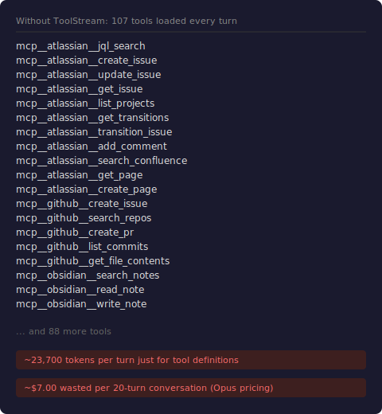
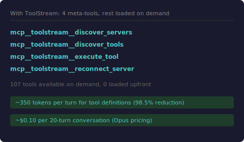
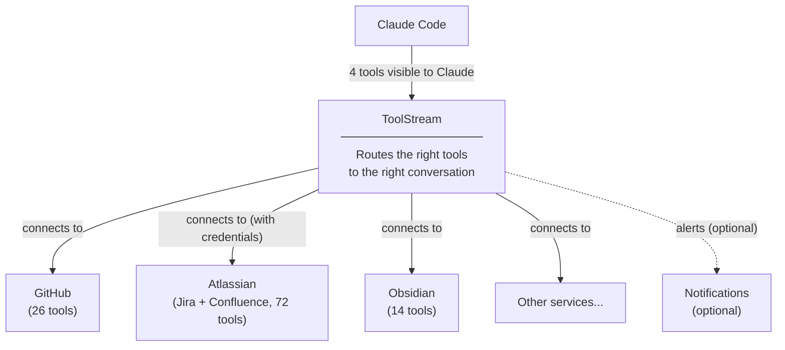

# ToolStream

[](https://github.com/tylerwilliamwick/toolstream/actions/workflows/ci.yml)
[](LICENSE)
[](https://nodejs.org)

Every time Claude Code starts a conversation, it loads the full list of tools from every connected service. If you have GitHub, Jira, Confluence, and a few other services connected, that can mean 100+ tool definitions sent to the model on every single turn, costing tens of thousands of tokens before you've typed a word.

ToolStream fixes this. It sits between Claude Code and your services, and instead of loading everything upfront, it figures out which tools are relevant based on what you're talking about. If you're discussing a Jira ticket, the Jira tools appear. If you're working with files, the file tools appear. Everything else stays out of the way.

**Result:** 90%+ fewer tokens spent on tool definitions, with no loss of capability.

## How It Works

### Before and After

<table>
<tr>
<td><strong>Before ToolStream</strong></td>
<td><strong>With ToolStream</strong></td>
</tr>
<tr>
<td></td>
<td></td>
</tr>
</table>

1. Claude Code connects to ToolStream instead of connecting to each service separately
2. ToolStream starts with just 4 small tools: discover_servers, discover_tools, execute_tool, and reconnect_server
3. As the conversation develops, ToolStream automatically brings in the tools that match what you're doing
4. If a tool doesn't appear on its own, Claude can search for it directly



## Quick Start

```bash
git clone https://github.com/tylerwilliamwick/toolstream.git
cd toolstream
npm install
npm run build
cp toolstream.config.example.yaml toolstream.config.yaml
# Edit toolstream.config.yaml with your MCP servers
node dist/index.js start toolstream.config.yaml
```

## Configuration Privacy

ToolStream separates public configuration from personal configuration:

- `toolstream.config.example.yaml`: copy this to get started; committed to source control
- `toolstream.config.yaml`: your live config with vault paths and service URLs; never committed (blocked by .gitignore)

Your Obsidian vault, Jira instance, and other service credentials live only in your local config and environment variables. They never leave your machine. Anyone who forks or clones this repo gets a clean slate with no personal data.

Note: ToolStream runs locally. When the proxy is active, it can call tools on your configured services, but only from your machine. No vault contents or credentials are transmitted to the repo or any remote service.

## Configuration

ToolStream uses a YAML config file. Copy `toolstream.config.example.yaml` to get started.

```yaml
toolstream:
  transport:
    stdio: true
  embedding:
    provider: "local"          # local ONNX inference, no API calls
    model: "all-MiniLM-L6-v2"
  routing:
    top_k: 5                   # tools surfaced per turn
    confidence_threshold: 0.3  # minimum similarity score
    context_window_turns: 3    # turns of context for routing
  storage:
    provider: "sqlite"
    sqlite_path: "./toolstream.db"

servers:
  - id: "filesystem"
    name: "Filesystem Server"
    transport: "stdio"
    command: "npx"
    args: ["-y", "@modelcontextprotocol/server-filesystem", "/home/user"]
    auth:
      type: "none"

  - id: "github"
    name: "GitHub MCP Server"
    transport: "stdio"
    command: "npx"
    args: ["-y", "@modelcontextprotocol/server-github"]
    auth:
      type: "bearer"
      token_env: "GITHUB_TOKEN"

  - id: "mcp-atlassian"
    name: "Atlassian (Jira + Confluence)"
    transport: "stdio"
    command: "uvx"
    args: ["mcp-atlassian"]
    auth:
      type: "none"
    env_passthrough:             # credentials from parent process env
      - "JIRA_URL"
      - "JIRA_USERNAME"
      - "JIRA_API_TOKEN"
      - "CONFLUENCE_URL"
      - "CONFLUENCE_USERNAME"
      - "CONFLUENCE_API_TOKEN"
```

## Claude Code Integration

Add ToolStream as an MCP server in your Claude Code settings:

```json
{
  "mcpServers": {
    "toolstream": {
      "command": "node",
      "args": ["/path/to/toolstream/dist/index.js", "/path/to/toolstream.config.yaml"],
      "env": {
        "GITHUB_PERSONAL_ACCESS_TOKEN": "your-github-token",
        "JIRA_URL": "https://yourorg.atlassian.net",
        "JIRA_USERNAME": "you@example.com",
        "JIRA_API_TOKEN": "your-jira-api-token",
        "CONFLUENCE_URL": "https://yourorg.atlassian.net/wiki",
        "CONFLUENCE_USERNAME": "you@example.com",
        "CONFLUENCE_API_TOKEN": "your-confluence-api-token"
      }
    }
  }
}
```

Credentials go in the `env` block of the toolstream server entry. ToolStream forwards them to upstream servers via `env_passthrough` in the YAML config. Then remove the individual MCP server entries that ToolStream proxies. ToolStream handles all of them through a single connection.

## Meta-Tools

These 4 tools are always visible to the LLM:

| Tool | Purpose |
|------|---------|
| `discover_servers` | List all upstream MCP servers with IDs and tool counts |
| `discover_tools` | Search for tools by natural language query |
| `execute_tool` | Call any tool on any server directly by name |
| `reconnect_server` | Force-reconnect a server that has gone offline |

## v2.0 Features

- **Usage analytics**: ToolStream tracks which tools you call and how often. Run `toolstream stats` to see a breakdown by server, tool, and time period.
- **Session-aware routing**: Tools you've used in the current session get a ranking boost. Frequently used tools pre-load at session start without needing a semantic search.
- **OpenAI embedding support**: Switch from local ONNX inference to OpenAI's embedding API by setting `embedding.provider: "openai"`. Useful if local inference is slow on your hardware.
- **Per-server top_k**: Set `routing.top_k` on an individual server to override the global limit for that server's tools. Useful when one server has many more tools than the others.

See the [docs](docs/index.md) for full configuration details.

---

## Architecture

- **Runtime**: Node.js 20+ with TypeScript
- **Embeddings**: `all-MiniLM-L6-v2` via `@xenova/transformers` (local, no API cost)
- **Storage**: SQLite with WAL mode via `better-sqlite3`
- **Protocol**: MCP 2025-06-18 spec compliant via `@modelcontextprotocol/sdk`

## Development

```bash
# Run tests
npm test

# Type check
npx tsc --noEmit

# Build
npm run build
```

## Token Savings

Without ToolStream, every MCP tool's full schema (description + JSON input schema) is included as input tokens on every API turn, whether or not you use that tool. ToolStream replaces all of them with 4 small meta-tool schemas.

### Measured data

The numbers below come from ToolStream's own SQLite database (`toolstream.db`), which stores every proxied tool's description and input schema. You can reproduce them:

```bash
# Total definition bytes across all proxied tools
sqlite3 toolstream.db "SELECT SUM(LENGTH(description) + LENGTH(input_schema)) FROM tools WHERE is_active = 1;"

# Per-server breakdown
sqlite3 toolstream.db "SELECT server_id, COUNT(*), SUM(LENGTH(description) + LENGTH(input_schema)) FROM tools WHERE is_active = 1 GROUP BY server_id;"
```

**Real-world setup: 112 tools across 3 servers**

| Server | Tools | Definition bytes |
|--------|------:|-----:|
| Atlassian (Jira + Confluence) | 72 | 74,151 |
| GitHub | 26 | 14,271 |
| Obsidian | 14 | 6,255 |
| **Total proxied** | **112** | **94,677** |
| **ToolStream meta-tools** | **4** | **1,393** |

The 4 meta-tool schemas (`discover_servers`, `discover_tools`, `execute_tool`, `reconnect_server`) are defined in `src/meta-tools.ts`. Their combined description + input schema is 1,393 bytes, measured from the same serialization format.

That's a **98.5% reduction** in tool definition bytes sent per turn (94,677 → 1,393).

### What this means per conversation

Tool definitions are input tokens. They're sent on every turn of a conversation, so savings compound with conversation length. Using a rough tokenizer estimate of ~4 characters per token:

| Conversation length | Tokens saved | At $15/M input (Opus) | At $3/M input (Sonnet) |
|--------------------:|-------------:|----------------------:|-----------------------:|
| 10 turns | ~233K | ~$3.50 | ~$0.70 |
| 20 turns | ~466K | ~$7.00 | ~$1.40 |
| 40 turns | ~933K | ~$14.00 | ~$2.80 |

### What's verified vs estimated

- **Verified:** Tool counts, definition byte sizes, and the byte reduction ratio. These are stored in the SQLite database and the source code. Run the queries above to confirm.
- **Estimated:** The token-to-dollar conversion. The ~4 chars/token ratio is an approximation for JSON/schema content. Actual tokenization varies by model. The cost-per-million-tokens pricing is model-dependent and subject to change.
- **Not accounted for:** Whether the LLM client applies any schema compression or caching of its own. If it does, the baseline cost without ToolStream would be lower, and ToolStream's delta would be smaller.

## Known Limitations

- **Single client per instance**: Toolstream uses a single session ID for stdio transport, designed for one-to-one client connections (e.g., one Claude Code instance). Running multiple clients against the same Toolstream instance will share session state.

## License

MIT
