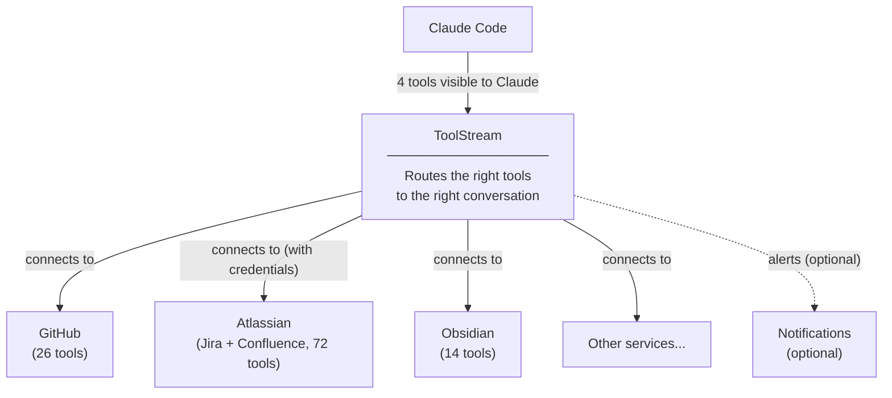

# ToolStream

[](https://github.com/tylerwilliamwick/toolstream/actions/workflows/ci.yml)
[](LICENSE)
[](https://nodejs.org)

Every time Claude Code starts a conversation, it loads the full list of tools from every connected service. If you have GitHub, Jira, Confluence, and a few other services connected, that can mean 100+ tool definitions sent to the model on every single turn, costing tens of thousands of tokens before you've typed a word.

ToolStream fixes this. It sits between Claude Code and your services, and instead of loading everything upfront, it figures out which tools are relevant based on what you're talking about. If you're discussing a Jira ticket, the Jira tools appear. If you're working with files, the file tools appear. Everything else stays out of the way.

**Result:** 90%+ fewer tokens spent on tool definitions, with no loss of capability.

## How It Works

1. Claude Code connects to ToolStream instead of connecting to each service separately
2. ToolStream starts with just 4 small tools: discover_servers, discover_tools, execute_tool, and reconnect_server
3. As the conversation develops, ToolStream automatically brings in the tools that match what you're doing
4. If a tool doesn't appear on its own, Claude can search for it directly



## Quick Start

```bash
git clone https://github.com/tylerwilliamwick/toolstream.git
cd toolstream
npm install
npm run build
cp toolstream.config.example.yaml toolstream.config.yaml
# Edit toolstream.config.yaml with your MCP servers
node dist/index.js start toolstream.config.yaml
```

## Configuration

ToolStream uses a YAML config file. Copy `toolstream.config.example.yaml` to get started.

```yaml
toolstream:
  transport:
    stdio: true
  embedding:
    provider: "local"          # local ONNX inference, no API calls
    model: "all-MiniLM-L6-v2"
  routing:
    top_k: 5                   # tools surfaced per turn
    confidence_threshold: 0.3  # minimum similarity score
    context_window_turns: 3    # turns of context for routing
  storage:
    provider: "sqlite"
    sqlite_path: "./toolstream.db"

servers:
  - id: "filesystem"
    name: "Filesystem Server"
    transport: "stdio"
    command: "npx"
    args: ["-y", "@modelcontextprotocol/server-filesystem", "/home/user"]
    auth:
      type: "none"

  - id: "github"
    name: "GitHub MCP Server"
    transport: "stdio"
    command: "npx"
    args: ["-y", "@modelcontextprotocol/server-github"]
    auth:
      type: "bearer"
      token_env: "GITHUB_TOKEN"

  - id: "mcp-atlassian"
    name: "Atlassian (Jira + Confluence)"
    transport: "stdio"
    command: "uvx"
    args: ["mcp-atlassian"]
    auth:
      type: "none"
    env_passthrough:             # credentials from parent process env
      - "JIRA_URL"
      - "JIRA_USERNAME"
      - "JIRA_API_TOKEN"
      - "CONFLUENCE_URL"
      - "CONFLUENCE_USERNAME"
      - "CONFLUENCE_API_TOKEN"
```

## Claude Code Integration

Add ToolStream as an MCP server in your Claude Code settings:

```json
{
  "mcpServers": {
    "toolstream": {
      "command": "node",
      "args": ["/path/to/toolstream/dist/index.js", "/path/to/toolstream.config.yaml"],
      "env": {
        "GITHUB_PERSONAL_ACCESS_TOKEN": "your-github-token",
        "JIRA_URL": "https://yourorg.atlassian.net",
        "JIRA_USERNAME": "you@example.com",
        "JIRA_API_TOKEN": "your-jira-api-token",
        "CONFLUENCE_URL": "https://yourorg.atlassian.net/wiki",
        "CONFLUENCE_USERNAME": "you@example.com",
        "CONFLUENCE_API_TOKEN": "your-confluence-api-token"
      }
    }
  }
}
```

Credentials go in the `env` block of the toolstream server entry. ToolStream forwards them to upstream servers via `env_passthrough` in the YAML config. Then remove the individual MCP server entries that ToolStream proxies. ToolStream handles all of them through a single connection.

## Meta-Tools

These 4 tools are always visible to the LLM:

| Tool | Purpose |
|------|---------|
| `discover_servers` | List all upstream MCP servers with IDs and tool counts |
| `discover_tools` | Search for tools by natural language query |
| `execute_tool` | Call any tool on any server directly by name |
| `reconnect_server` | Force-reconnect a server that has gone offline |

## Architecture

- **Runtime**: Node.js 20+ with TypeScript
- **Embeddings**: `all-MiniLM-L6-v2` via `@xenova/transformers` (local, no API cost)
- **Storage**: SQLite with WAL mode via `better-sqlite3`
- **Protocol**: MCP 2025-06-18 spec compliant via `@modelcontextprotocol/sdk`

## Development

```bash
# Run tests
npm test

# Type check
npx tsc --noEmit

# Build
npm run build
```

## Token Savings

| Scenario | Before | After | Savings |
|----------|--------|-------|---------|
| 112 tools (GitHub + Obsidian + Atlassian) | ~35K tokens/session start | ~1.5K tokens/session start | 96% |
| 200 tools | ~100K tokens/turn | ~2.8K tokens/turn | 97% |

Real-world example: Atlassian alone has 72 tools. Without ToolStream, all 72 tool schemas load on every session start. With ToolStream, they only load when you first call a Jira or Confluence tool.

## Known Limitations

- **Single client per instance**: Toolstream uses a single session ID for stdio transport, designed for one-to-one client connections (e.g., one Claude Code instance). Running multiple clients against the same Toolstream instance will share session state.

## License

MIT
